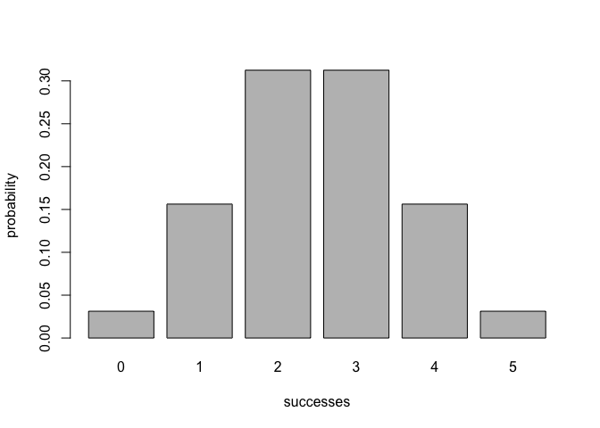

<!-- README.md is generated from README.Rmd. Please edit that file -->
Overview
--------

'"binomial"' is an R pacakge that implements functions for calculating probabilities of a binomial random variable, and related calcualtions such as the probability distribution, the expected value, variance, etc.

Motivation
----------

This package had been developed to help the author gain familiarity with building R packages and provide tools for calculating probabilties of binomial random variables.

Installation
------------

You can install the released version of binomial from [CRAN](https://CRAN.R-project.org) with:

``` r
install.packages("binomial")
```

And the development version from [GitHub](https://github.com/) with:

``` r
# install.packages("devtools")
devtools::install_github("stat133-sp19/hw-stat133-elainekwan")
```

Usage
-----

``` r
library(binomial)
## basic example code

# probability of getting 2 successes in 5 trials
# (assuming prob of success = 0.5)
bin_probability(success = 2, trials = 5, prob = 0.5)
#> [1] 0.3125

# binomial probability distribution
bin_distribution(trials = 5, prob = 0.5)
#> Warning in if (sum(success <= trials) == length(success) & success%%1 == :
#> the condition has length > 1 and only the first element will be used
#>   success probability
#> 1       0     0.03125
#> 2       1     0.15625
#> 3       2     0.31250
#> 4       3     0.31250
#> 5       4     0.15625
#> 6       5     0.03125

# plotting binomial probability distribution
dis1 <- bin_distribution(trials = 5, prob = 0.5)
#> Warning in if (sum(success <= trials) == length(success) & success%%1 == :
#> the condition has length > 1 and only the first element will be used
plot(dis1)
```



``` r

# binomial cumulative distribution
bin_cumulative(trials = 5, prob = 0.5)
#> Warning in if (sum(success <= trials) == length(success) & success%%1 == :
#> the condition has length > 1 and only the first element will be used
#>   success probability cumulative
#> 1       0     0.03125    0.03125
#> 2       1     0.15625    0.18750
#> 3       2     0.31250    0.50000
#> 4       3     0.31250    0.81250
#> 5       4     0.15625    0.96875
#> 6       5     0.03125    1.00000

# plotting binomial cumulative distribution
dis2 <- bin_cumulative(trials = 5, prob = 0.5)
#> Warning in if (sum(success <= trials) == length(success) & success%%1 == :
#> the condition has length > 1 and only the first element will be used
plot(dis2)
```


``` r

# summary of a binomial variable
bin1 <- bin_variable(trials = 10, p = 0.3)
binsum1 <- summary(bin1)
binsum1
#> "Summary Binomial"
#> 
#> Parameters
#> -number of trials:  10
#> -prob of success:  0.3
#> 
#> Measures
#> -mean:  3
#> -variance:  2.1
#> -mode:  3
#> -skewness:  0.2760262
#> -kurtosis:  -0.1238095

# functions of measures
bin_variance(10, 0.3)
#> [1] 2.1
bin_mode(10, 0.3)
#> [1] 3
bin_skewness(10, 0.3)
#> [1] 0.2760262
bin_kurtosis(10, 0.3)
#> [1] -0.1238095
```
