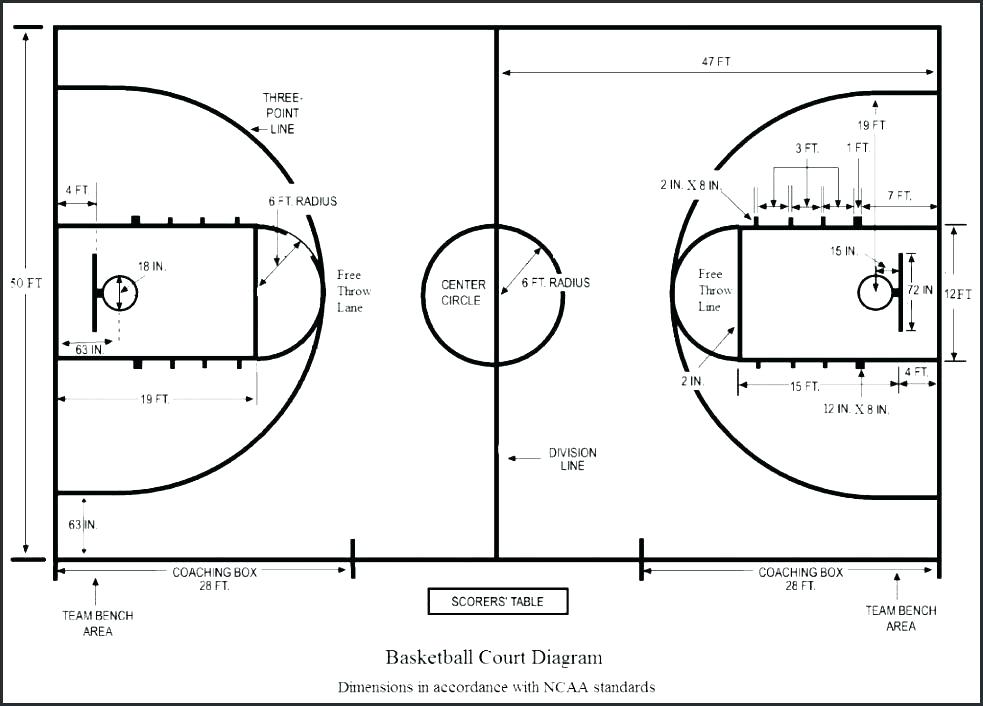

#For these Golden State Warriors: Does Salary Exactly Correlate to Scoring Ability?

##Motivation

As one would expect, the most valuable basketball players are generally those that score the most points. And unsurprisingly, these high-scorers usually earn the highest salaries. Though there is certainly a trend correlating salary with shooting performance, the data shows that shooting ability alone is not enough to determine salary. If the ability to score was the only factor in determining pay, one would expect that the n^th^-best scorer on the team would make the n^th^-highest salary. However, further analysis into the top five highest paid players on the Golden State Warriors shows that this is not the case. This report investigates the role of a player’s shooting effectiveness as well as other potential factors when determining a player’s salary.

##Background

Some background information on basketball is needed in order to understand later analyses and discussion. In the game of basketball, points can be scored in three ways. A basket scored from outside the three-point arc will result in three points being scored. Baskets scored from within the three-point arc will result in two points being scored (Figure 1). Free throws will result in one point scored per free throw, and the number of free throws will depend on where the foul was committed. This report will neglect the analysis of free throws and instead focus on three-point and two-point shots to determine shooting effectiveness [1].

```{r out.width = '80%', echo = FALSE, fig.align = 'center'}
library(knitr)

```
<center>
**Figure 1:** Layout of a basketball court 
</center>

Traditionally, there are five specific positions on the court: Point Guard, Shooting Guard, Small Forward, Power Forward, and Center. The Point Guard is responsible for advancing the basketball up the court and setting up the team’s offense. The Shooting Guard is a scoring position and this player is responsible for shooting consistently from outside, midrange, and close to the basket. The Small Forward is often the most versatile of the 5 basketball positions on the court both offensively and defensively. The Power Forward usually plays close to the basket, and in past years the player in this position has scored the majority of the two-point shots. The Center spends most of the game close to the basket and will often score the majority of their points close to the rim through offensive rebounds [1].

For the 2016-2017 season, the top five paid players on the Golden State Warriors were Kevin Durant, Klay Thompson, Draymond Green, Stephen Curry, and Andre Iguodala respectively (Table 1). These five players will be the subject of our analysis and discussion.

|**Player**|**Salary**|**Position**|
| ------------- |-------------  |----------------- |
| Kevin Durant        | $26,540,100| Small Forward|
| Klay Thompson       | $16,663,575| Shooting Guard|
| Draymond Green   | $15,330,435| Power Forward |
| Stephen Curry   | $12,112,359| Point Guard |
| Andre Iguodala    | $11,131,368| Small Forward |

**Table 1:** The top five highest paid players on the Golden State Warriors and their positions in the 2016-2017 season [2][3]

##Data
The raw data used for this report was provided in the form of csv files and contains shot information for each of the five players in our analysis. Each shot from each player was recorded for the 2016-2017 season. Along with information about whether the shot entered the basket, the raw data also specifies where the shot was taken relative to the basket, and whether the shot was worth two or three points. Some minor modifications were made to the raw data in order to make the data more readable. For instance, a column with the player’s name was added, and the marker to indicate whether a shot was made was changed from “n” to “shot_no” and “y” to “shot_yes.” Other variables such as opponent, game date, time remaining, etc. were also provided but not used in the scope of this report. 

##Analysis
This report analyzed the two-point, three-point, and overall shot percentages for the top five paid players on the Golden State Warriors. To determine these percentages, total shots made was divided by total shots and multiplied by 100. The calculated shooting percentages for each player are tabulated in the data tables below:

```{r effective_shooting, echo = FALSE, message = FALSE}
#code used to generate tables of effective shooting percentages

library(dplyr)
library(knitr)
#make tables of effective shooting percentages

#import shots data
column_types = c("character","character","integer","integer","real","real","character","character",
                 "character","real","character","real","real","character","real")
column_names = c("team_name","game_date","season","period","minutes_remaining","seconds_remaining",
                 "shot_made_flag","action_type","shot_type","shot_distance","opponent","x","y","name","minute")

shots_data <- read.csv("../data/shots-data.csv",   
                       colClasses = column_types,
                       col.names = column_names,
                       stringsAsFactors = FALSE)

#get individual player shots data
iguodala = filter(shots_data,shots_data$name == "Andre Iguodala")
green = filter(shots_data,shots_data$name == "Draymond Green")
durant = filter(shots_data,shots_data$name == "Kevin Durant")
thompson = filter(shots_data,shots_data$name == "Klay Thompson")
curry = filter(shots_data,shots_data$name == "Stephen Curry")

#name = unique(shots_data$name)
name = c('Andre Iguodala','Draymond Green','Kevin Durant','Klay Thompson','Stephen Curry')

#get 2pt effective shooting percentages
twopt_iguodala = filter(iguodala,iguodala$shot_type == '2PT Field Goal')
twopt_green = filter(green,green$shot_type == '2PT Field Goal')
twopt_durant = filter(durant,durant$shot_type == '2PT Field Goal')
twopt_thompson= filter(thompson,thompson$shot_type == '2PT Field Goal')
twopt_curry = filter(curry,curry$shot_type == '2PT Field Goal')

twopt_total_iguodala = nrow(twopt_iguodala)
twopt_total_green = nrow(twopt_green)
twopt_total_durant = nrow(twopt_durant)
twopt_total_thompson = nrow(twopt_thompson)
twopt_total_curry= nrow(twopt_curry)

total_twopt = c(twopt_total_iguodala,twopt_total_green,twopt_total_durant,twopt_total_thompson,twopt_total_curry)

made_twopt_iguodala = nrow(filter(twopt_iguodala,twopt_iguodala$shot_made_flag == "shot_yes"))
made_twopt_green = nrow(filter(twopt_green,twopt_green$shot_made_flag == "shot_yes"))
made_twopt_durant = nrow(filter(twopt_durant,twopt_durant$shot_made_flag == "shot_yes"))
made_twopt_thompson = nrow(filter(twopt_thompson,twopt_thompson$shot_made_flag == "shot_yes"))
made_twopt_curry = nrow(filter(twopt_curry,twopt_curry$shot_made_flag == "shot_yes"))

made_twopt = c(made_twopt_iguodala,made_twopt_green,made_twopt_durant,made_twopt_thompson,made_twopt_curry)
perc_twopt_made = signif((made_twopt/total_twopt)*100,3)

twopt_eff = cbind(name,total_twopt,made_twopt,perc_twopt_made)
twopt_effective = data.frame(twopt_eff,stringsAsFactors = FALSE)
colnames(twopt_effective) = c("name","total 2pt shots","total 2pt shots made","percent made of 2pt shots")

twopt_effective = arrange(twopt_effective, desc(perc_twopt_made))

#get 3pt effective shooting percentages
threept_iguodala = filter(iguodala,iguodala$shot_type == '3PT Field Goal')
threept_green = filter(green,green$shot_type == '3PT Field Goal')
threept_durant = filter(durant,durant$shot_type == '3PT Field Goal')
threept_thompson= filter(thompson,thompson$shot_type == '3PT Field Goal')
threept_curry = filter(curry,curry$shot_type == '3PT Field Goal')

threept_total_iguodala = nrow(threept_iguodala)
threept_total_green = nrow(threept_green)
threept_total_durant = nrow(threept_durant)
threept_total_thompson = nrow(threept_thompson)
threept_total_curry= nrow(threept_curry)

total_threept = c(threept_total_iguodala,threept_total_green,threept_total_durant,threept_total_thompson,threept_total_curry)

made_threept_iguodala = nrow(filter(threept_iguodala,threept_iguodala$shot_made_flag == "shot_yes"))
made_threept_green = nrow(filter(threept_green,threept_green$shot_made_flag == "shot_yes"))
made_threept_durant = nrow(filter(threept_durant,threept_durant$shot_made_flag == "shot_yes"))
made_threept_thompson = nrow(filter(threept_thompson,threept_thompson$shot_made_flag == "shot_yes"))
made_threept_curry = nrow(filter(threept_curry,threept_curry$shot_made_flag == "shot_yes"))

made_threept = c(made_threept_iguodala,made_threept_green,made_threept_durant,made_threept_thompson,made_threept_curry)
perc_threept_made = signif((made_threept/total_threept)*100,3)

threept_eff = cbind(name,total_threept,made_threept,perc_threept_made)
threept_effective = data.frame(threept_eff,stringsAsFactors = FALSE)
colnames(threept_effective) = c("name","total 3pt shots","total 3pt shots made","percent made of 3pt shots")

threept_effective = arrange(threept_effective, desc(perc_threept_made))

#get overall effective shooting percentages
total_shots_iguodala = nrow(iguodala)
total_shots_green = nrow(green)
total_shots_durant = nrow(durant)
total_shots_thompson = nrow(thompson)
total_shots_curry = nrow(curry)
total = c(total_shots_iguodala,total_shots_green,total_shots_durant,total_shots_thompson,total_shots_curry)

made_iguodala = nrow(filter(iguodala,iguodala$shot_made_flag == "shot_yes"))
made_green = nrow(filter(green,green$shot_made_flag == "shot_yes"))
made_durant = nrow(filter(durant,durant$shot_made_flag == "shot_yes"))
made_thompson = nrow(filter(thompson,thompson$shot_made_flag == "shot_yes"))
made_curry = nrow(filter(curry,curry$shot_made_flag == "shot_yes"))
made = c(made_iguodala,made_green,made_durant,made_thompson,made_curry)

perc_made = signif((made/total)*100,3)
overall_eff = cbind(name,total,made,perc_made)
overall_effective = data.frame(overall_eff,stringsAsFactors = FALSE)
colnames(overall_effective) = c("name","total shots","total shots made","percent made of total shots")
overall_effective = arrange(overall_effective, desc(perc_made))


#output the data tables of shooting percentages
kable(twopt_effective, caption = '2PT shooting percentages')
kable(threept_effective, caption = '3PT shooting percentages')
kable(overall_effective, caption = 'overall shooting percentages')

```

```{r out.width = '80%', echo = FALSE, fig.align = 'center'}
library(knitr)
knitr::include_graphics('../images/gsw-shot-charts.png')
```
<center>
**Figure 2:** Shot chart for each player indicating the location of a shot and whether the shot was made.
</center>

In order to better visualize where these shots were made relative to the basketball court, we refer to Figure 2. This visualization places a circular data point at the x and y coordinates where each shot was taken and indicates with color whether the shot entered the basket. 

##Discussion

From our analysis, we can see that the scoring ability does not correlate exactly with salary. While the top five paid players are Kevin Durant, Klay Thompson, Draymond Green, Stephen Curry, and Andre Iguodala respectively, the players with the best overall shooting percentages are Durant, Iguodala, Thompson, Curry, and Green respectively. Referring to the data tables in the Analysis of this report, we see that salary does not correlate exactly with two-point or three-point shooting ability either. The best two-point scorers were Iguodala, Durant, Curry, Thompson, and Green respectively, while the best three-point scorers where Thompson, Curry, Durant, Iguodala, and Green respectively. Moreover, the salary amount does not increase linearly with scoring ability. Durant, the highest earning player, earned approximately 59% more than Thompson, the next highest paid player – even though Durant’s overall scoring percentage was only 7% better than Thompson’s. These observations indicate that factors independent of scoring ability are at play when determining a player’s salary. 

One likely explanation is that a player’s value (and therefore salary) to the team depends on more than scoring ability. In the sport of basketball, skills such as ball handling, the ability to play defensively, the creativity to execute plays, the ability to open up opportunities for teammates, and leadership on the court are also crucial to the team’s overall success. These factors are more difficult to quantify than scoring ability but are nonetheless important qualities of a good basketball player. Furthermore, some player positions may present more opportunity for scoring than others. For instance, the Point Guard’s role in advancing the ball up the court is crucial but may provide fewer opportunities for scoring than positions such as the Small Forward. Though Iguodala (a Small Forward) scores more two-point shots and overall shots than Curry (a Point Guard), Curry still earns a higher salary. This provides further evidence that a player’s value is derived from many factors. 

##Conclusion

After analysis and discussion of the data, it can be concluded that a player’s salary is not solely dependent on his shooting ability. While it is true that high-scorers will generally earn high salaries, the correlation is not perfect. Though the five players analyzed each have high scoring percentages relative to basketball players as a whole within the NBA, their value is derived from a combination of skills and abilities.

###References
[1] “Basketball Rules,” Baseball Rules: How To Play Baseball | Rules of Sport. [Online]. Available: <http://www.rulesofsport.com/sports/basketball.html>. [Accessed: 12-Mar-2019].

[2] “2016-17 Golden State Warriors,” 2009-10 Golden State Warriors - NBA team profile page from WhatifSports. [Online]. Available: <https://www.whatifsports.com/nba-l/profile_team.asp?hfid=9&season=2016-17>. [Accessed: 12-Mar-2019].

[3] “Golden State Warriors Salary Archive – 2016/17,” Basketball Insiders | NBA Rumors And Basketball News, 21-Apr-2017. [Online]. Available: <http://www.basketballinsiders.com/golden-state-warriors-team-salary/golden-state-warriors-salary-archive-201617/>. [Accessed: 12-Mar-2019].
